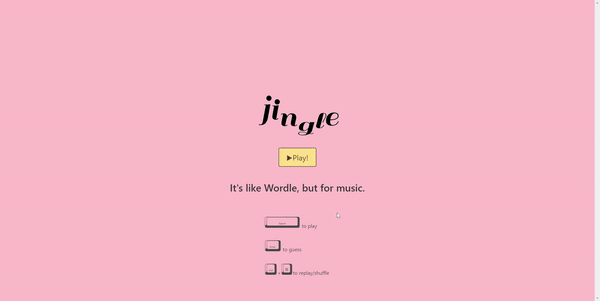

# Jingle (Music Wordle)

## The Challenge 🔐
Our client request us to build an application using the knowledge we've learned over the past six modules to create a real-world-front-end application that we can show our potential
employers. Our application must use at least two server-side APIs and store persistent data in client-side storage. 




## The Concept 🎤
We wanted to find a interactive way to use data from an API that worked with music specifically, was inspired by the recent game wordle. Small music themed game that uses the last.fm API to pull a top track list, and Wikipedia’s MediaWiki Api to pull a artist photo, so that users can play by guessing the artist who performed a song name that is randomly generated.

## User Story 📖

```
AS A player, 
I WANT to get a random song name, 
SO THAT I can guess what artist performed that song
```

## The Logic 💻
```
GIVEN that I want to play a music guessing game 
WHEN I click play
THEN I am represented with a song and an input field to guess the artist of that song
WHEN I guess the right artist
THEN I am revealed the artist name and picture
WHEN I guess incorrectly
THEN I am revealed another song from the artist up to three times
WHEN I guess incorrectly for the third time
THEN I am revealed with a picture to guess who the artist is
WHEN I guess incorrectly for the fourth time
THEN I am revealed the artist name and picture
WHEN I am done playing
THEN I can see how many times I have guessed correctly
``` 

## The Process 📝
To satisfy our client's needs, we had to:
- Create an HTML file that imports Bulma, CSS File, JavaScript file, Confetti JS, and jQuery
- Utilize Bulma to give our user a fun and polished interface
- Create a JavaScript file that imports web server API from WikiPedia and LastFm
- Modify HTML file to dynamically work with JavaScript file and CSS file

HTML File

```
Link the following files/library:
CSS file, Bulma Library, Confetti JS, Javascript File, and jQuery Library
```

CSS File

```
- Pink background
- @keyframes animation for incorrect answers
- Stylized buttons
- Animated border around artist's image
- User's viewport adaptability
```
Specific functions in JavaScript file

Load game and hide landing page 

```javascript
playButton.onclick = function () {
    if (targetDiv.style.display == "none") {
      targetDiv.style.display = "block";
      start.style.display = "none";
      document.getElementById("guess").select();
    }
  };
```

Fetch 4 top tracks from a random artist and appends on list

```javascript
fetch('https://ws.audioscrobbler.com/2.0/?method=artist.gettoptracks&artist='+artistX+'&limit=4&api_key=3fa1d67efdf9fbda6b5c07411588e640&format=json')
.then(function(response){
    return response.json();
})
.then(function(data){
        for (i=0; i<4; i++){
        var firstTrack = data.toptracks.track[i].name;
        trackList[i].innerHTML = firstTrack;
        }
      })  
```

Fetch artist's image from mediaWiki API 

```javascript
var url = "https://en.wikipedia.org/w/api.php"; 
var noSpace = artistX.replace(/ /g,"%20")
var params = {
    action: "query",
    prop: "pageimages",
    titles: `${noSpace}`,
    format: "json",
    piprop: "original",
};
url = url + "?origin=*";
Object.keys(params).forEach(function(key){url += "&" + key + "=" + params[key];});
fetch(url)
    .then(function(response){return response.json();})
    .then(function(response) {
        var responseQuery = response.query.pages;


        var pageId = Object.keys(responseQuery)
        var pages = response.query.pages[pageId[0]].original.source;

        document.querySelector("#img").src = pages;
        });
```

Check answer and provide feedback based on users' guess and turn

```javascript
function guessBtn(){
    document.getElementById('guess').focus() 
    if ($('#guess').val().toLowerCase() === artistX.toLowerCase() || $('#guess').val().toLowerCase() === artistX.toLowerCase()){
        right.play();
        feedback.innerHTML = "Correct! It's " + artistX + "!"
        restartBtn.style.display = "inline-block";
        track4.style.display = "block";
        saveScore();
    }else{
        if(userTurn < 1){    // shake and reveal another song as hint
            userTurn++
            document.getElementById("track" + userTurn).style.display = "block"
            feedback.innerHTML = "Not quite! Here's a hint.";
            wrong.play()
    }   
  return
};
```

Track how many wins user has

```javascript
var counter = localStorage.getItem('counter') || 0;

function saveScore() {
    counter ++; 
    window.localStorage.setItem('counter', JSON.stringify(counter)); 
}
```


## The Result 🏆
After importing Bulma, jQuery, Confetti Js to our HTML file along with dynamically coding Javascript and stylizing CSS, we were able to provide a fun, interactive, and polished music guessing game. 


## The Collaborators 🧑‍🤝‍🧑
[Daisey Lien](https://github.com/quynhlien2002)

[Jeffrey Tran](https://github.com/jtran028)

[Mimi Sanguinetti](https://github.com/mimisfriend)

[Max Lin](https://github.com/max-lin95)

[Nhan Nguyen](https://github.com/nhanng19)
## Submission
This project was uploaded to GitHub at the following repository link:
[https://github.com/nhanng19/music_wordle](https://github.com/nhanng19/music_wordle)

Deployed Web Application Link:
[https://nhanng19.github.io/music_wordle/](https://nhanng19.github.io/music_wordle/)
